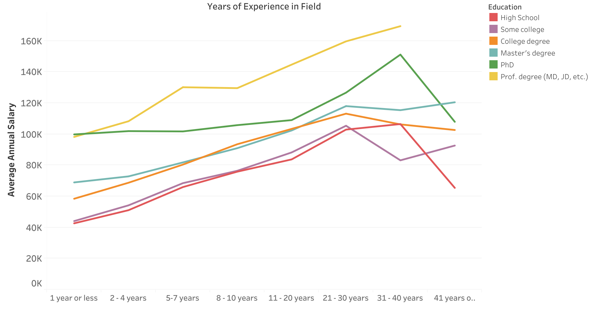

# Earning Insights:
## Dissecting the Drivers of Average Incomes in the US

I’m intrigued by the various ways in which individuals earn their livelihoods and the factors that influence their earnings. The extent to which certain elements contribute to compensation is a topic of great curiosity to me. 

This analysis aims to uncover insights into how geography, gender, education, and experience impact the average salary of an American. 

### Dataset

The dataset utilized in this analysis was sourced from [AskAManager.org](https://www.askamanager.org/2021/04/how-much-money-do-you-make-4.html), a platform hosting a real-time salary survey with a predominant focus on the United States. The survey gathers compensation-related information from anonymous participants and is continuously updated. The dataset used for this analysis was obtained on August 20, 2023, at 15:46 (PST). This timestamp ensures a specific reference point for the data snapshot taken, which aids in maintaining temporal context throughout the analysis.

### Questions

1. What states have the highest salaries within each industry?
2. Which industries offer the highest average salaries within each age group?
3. Does gender have a varying impact on salary in specific states and industries?
4. Is there a correlation between education level, years of professional experience and salary? Specifically, does the highest degree earned correlate with salary differences among individuals with equal professional experience?

### Technical Challenges

1. Messy data:
  * There were multiple free-form answers resulting in spelling, spacing and capitalization errors
  * Annual salary column included a comma and surveyors submitted extreme amounts
  * Missing values in the state column
2. The industry column allowed an ‘Other’ option (more free-form text to sort)
3. Roughly 16% of the data was from outside of the US
4. The race column allowed for multiple selections and an ‘Other’ option (decided to exclude race as a factor for analysis)

### Approach
#### Data Exploration

In PgAdmin, I set up a new database named 'salary'. Then, I used an SQL command to create a table with 17 distinct columns. After making sure that the data was imported correctly, I began querying the relevant fields in an attempt to answer each one of the questions outlined earlier. This led to many discoveries about the data. Some of which included:
  * About 77% of the responses were from women
  * Around 83% of the people who answered identified as ‘White’
  * Over 25% of responses came from either California, New York or Massachusetts combined

#### Data Cleaning

In Excel, I began by removing duplicates from the entire dataset. I also eliminated the commas from the ‘annual_salary’ column so that I could import that field into PostgreSQL as an integer. I thought it would be more convenient to address the free-form answers using SQL, so I imported the table data back into PostgreSQL. For the ‘country’ column, I standardized all relevant entries to ‘US’. Additionally, I populated empty ‘currency’ fields with ‘USD’ if ‘alt_currency’ had ‘USD’ listed. At this stage, I started deleting data that fell outside of the scope of both the US and USD. Further SQL querying revealed a decent amount of missing values in the ‘us_state’ field.

Back in Excel, I populated the ‘us_state’ column when the state was mistakenly entered into the ‘city’ column or when it was possible to identify a corresponding US city. At this point, additional inconsistencies were removed, as some non-US cities were included. The next step involved the 'industry' column. I manually sorted the responses labeled as ‘Other’ into existing industries and introduced new categories when necessary. Lastly, I removed outliers from the ‘annual_salary’ column in PostgreSQL. This involved excluding values below $10,000 and exceeding a certain threshold calculated using the formula (average salary + 3 * standard deviation).

#### Data Analysis

##### Question 1: What states have the highest salaries within each industry?

Clearly, states such as California, Washington, D.C., and New York stand out for having notably higher salaries per industry when compared to other states. This isn't really surprising, since these regions are major economic hubs with strong industries. 

##### Question 2: Which industries offer the highest average salaries within each age group?

Among the age groups of 18-24 and 25-34, Computing and Tech emerges as the top-paying industry. There's a slight shift in favor of Pharmaceuticals compared to Computing and Tech for the age ranges of 35-44 and 45-54. Moving on, the highest paying industry for those aged 55-64 is Energy, while Business and Consulting take the lead for individuals aged 65 and above.

##### Question 3: Does gender have a varying impact on salary in specific states and industries?

This initial chart indicates that men tend to have a higher average salary compared to women in all states except for Delaware, Maine, and Wyoming. There appears to be little to no discernible correlation between geographical regions and the gender pay gap. The data suggests a trend where men consistently earn higher average salaries across all regions of the country.

Similarly, only four industries show women earning a higher average salary than their male counterparts. These industries are Pharmaceuticals, Agriculture or Forestry, Law Enforcement & Security, and Animal Care.

##### Question 4:  Is there a correlation between education level, years of professional experience and salary? Specifically, does the highest degree earned correlate with salary differences among individuals with equal professional experience?

When considering individuals with 4 years or less of professional experience in the field, a notable correlation emerges between higher salaries and individuals with advanced education and higher degrees. This correlation results in an approximate $60,000 disparity in averages. However, for those with 21-30 years of experience, the influence of education level on average salary appears to diminish, with the gap narrowing to around $20,000. Additionally, there is a general decline in average salary across all educational backgrounds when the experience level reaches 40 years or more.

#### Deeper Analysis

Finally, I wondered which states had a smaller gender pay gap ratio than the country’s average. To figure this out, I used PostgreSQL. I looked at how much men and women make on average in each state, then compared it to the national average for the whole country. I made a new table with these comparisons so that I could create a filled map in Tableau that shows each state's situation compared to the country. 

In this map, 100 means that men and women earn the same. The country's average is 77, which is not so good. The lower the number, the worse the situation is for women (shown in dark red). Remember, only Delaware, Maine, and Wyoming have numbers above 100 (shown in dark green).

### Results

This section presents key findings from the analysis of salary data across various demographic factors and industries.

1. **Economic Centers and Salaries**: Notable economic centers such as California, New York, and Washington, D.C. demonstrate the highest average salaries across industries.
2. **Age and Top-Paying Industries**: Among different age groups, the Computing and Tech industry emerges as the highest paying for individuals aged 18-24 and 25-34. Pharmaceuticals gains prominence in the 35-44 and 45-54 age brackets. Energy and Business/Consulting lead for those aged 55-64 and 65 and above, respectively.
3. **Gender Disparities**: Men generally earn higher average salaries than women across most states, except for Delaware, Maine, and Wyoming. Only four industries show women earning more: Pharmaceuticals, Agriculture/Forestry, Law Enforcement & Security, and Animal Care.
4. **Education and Experience**: For individuals with 4 years or less of experience, advanced education correlates with significantly higher salaries, resulting in an approximate $60,000 difference. However, this correlation weakens with 21-30 years of experience, narrowing the gap to around $20,000. After 40 years of experience, average salaries decrease across all education levels.
5. **Gender Pay Gap Map**: A map illustrating gender pay gap scores across states indicates the equality between men and women's earnings. The national average score of 77 suggests a gender pay gap, with scores below 100 indicating more unfavorable situations for women. Delaware, Maine, and Wyoming stand out with scores above 100, indicating better gender pay equality.

These findings highlight the intricate interplay of geographic, demographic, and industry-related factors in shaping salary disparities and trends in the US.

